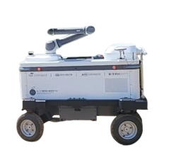
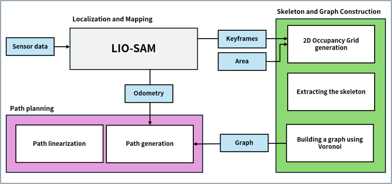
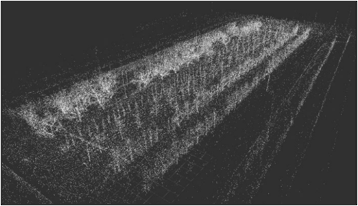
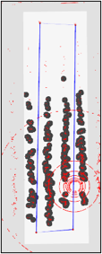
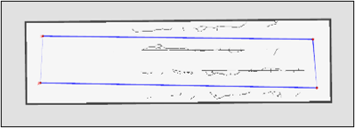
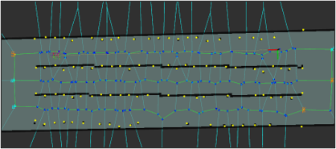
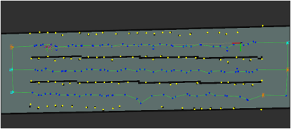

# AOS (Active Orchard SLAM) - Autonomous Orchard Exploration and Monitoring System

[](https://docs.ros.org/en/humble/)
[](LICENSE)

AOS is a ROS2-based system for autonomous exploration and monitoring in orchard environments. Integrated with LIO-SAM SLAM, it detects tree rows without prior maps and performs systematic exploration through Generalized Voronoi Diagram (GVD) based path planning.



## 📋 Table of Contents

- [Key Features](#key-features)
- [System Architecture](#system-architecture)
- [Installation](#installation)
- [Node Descriptions](#node-descriptions)
- [Usage](#usage)
- [Parameter Configuration](#parameter-configuration)
- [API Reference](#api-reference)
- [Troubleshooting](#troubleshooting)
- [Contributing](#contributing)

## 🎯 Key Features

### Core Capabilities
- **Tree Row Detection**: Clusters individual trees from point clouds and automatically recognizes row structures
- **GVD-based Path Planning**: Generates safe paths using Generalized Voronoi Diagram
- **Autonomous Exploration**: Systematic waypoint traversal within exploration areas
- **GPS/UTM Conversion**: Converts GPS coordinates to UTM coordinate system for SLAM integration
- **State Machine Control**: Automatic mode switching between path following, precise control, semi-precise control, and stop modes
- **RViz2 Integration**: Real-time visualization and interactive control panel

### Orchard-Specific Features
- **Skeletonization**: Skeletonizes occupancy grids to extract tree row centerlines
- **Voronoi Seed Generation**: Generates Voronoi seeds based on tree row start/end points and confirmed tree locations
- **Cluster-based Waypoints**: Uses TL/TR/BL/BR points of each tree row cluster as waypoints
- **Docking State Management**: Waits for docking completion upon waypoint arrival and automatically resumes

## 🏗️ System Architecture



### Node Structure

```
┌─────────────────┐
│  LIO-SAM SLAM   │
│  (External)     │
└────────┬────────┘
         │ Point Cloud
         ▼
┌─────────────────────┐
│  gps_to_utm_node    │◄─── GPS (NavSatFix)
│  GPS → UTM          │
└──────────┬──────────┘
           │ Exploration Area (PolygonStamped)
           ▼
┌─────────────────────┐
│  aos_seed_gen_node  │◄─── Global Map (PointCloud2)
│  Tree Row Detection │
│  Voronoi Seed Gen   │
└──────────┬──────────┘
           │ Voronoi Seeds, Tree Rows
           ▼
┌─────────────────────┐
│   aos_gvd_node      │◄─── Occupancy Grid
│   GVD Graph Gen     │
└──────────┬──────────┘
           │ GVD Graph
           ▼
┌─────────────────────┐
│  aos_path_gen_node  │◄─── Robot Position, Control Mode
│  Path Planning      │
└──────────┬──────────┘
           │ Path
           ▼
┌─────────────────────┐
│aos_path_linearization│
│      _node          │
│  Path Linearization │
└──────────┬──────────┘
           │ Linearized Path
           ▼
┌─────────────────────┐
│aos_state_machine_node│◄─── Odometry
│  State Machine      │
└──────────┬──────────┘
           │ Control Mode, Goal Point
           ▼
      Control System
```

### Data Flow

1. **LIO-SAM** → Generates point cloud
2. **gps_to_utm_node** → Converts GPS coordinates to UTM and defines exploration area
3. **aos_seed_gen_node** → Processes point cloud to:
   - Generate occupancy grid
   - Perform skeletonization
   - Detect tree row clusters
   - Generate Voronoi seeds
4. **aos_gvd_node** → Generates GVD graph from Voronoi seeds
5. **aos_path_gen_node** → Plans paths between waypoints using GVD graph
6. **aos_path_linearization_node** → Splits path into linear segments
7. **aos_state_machine_node** → Determines control mode based on robot state



## 📦 Installation

### System Requirements

- **OS**: Ubuntu 22.04 LTS
- **ROS2**: Humble Hawksbill
- **Memory**: Minimum 8GB RAM (Recommended: 16GB)
- **GPU**: NVIDIA GPU (Recommended for Voxblox)

### Dependency Installation

#### 1. Install ROS2 Humble

```bash
# Install ROS2 Humble on Ubuntu 22.04
sudo apt update
sudo apt install software-properties-common
sudo add-apt-repository universe
sudo apt update && sudo apt install curl -y
sudo curl -sSL https://raw.githubusercontent.com/ros/rosdistro/master/ros.asc | sudo apt-key add -
sudo apt update
sudo apt install ros-humble-desktop
```

#### 2. Install System Dependencies

```bash
# ROS2 package dependencies
sudo apt install \
  ros-humble-pcl-ros \
  ros-humble-pcl-conversions \
  ros-humble-rviz2 \
  ros-humble-tf2-eigen \
  ros-humble-tf2-geometry-msgs \
  ros-humble-visualization-msgs \
  ros-humble-nav-msgs \
  ros-humble-sensor-msgs \
  ros-humble-geometry-msgs

# System libraries
sudo apt install \
  libpcl-dev \
  libeigen3-dev \
  libopencv-dev \
  libgeographic-dev \
  qtbase5-dev \
  libnlohmann-json3-dev

# GeographicLib (for GPS/UTM conversion)
sudo apt install libgeographic-dev
```

#### 3. LIO-SAM Dependency

This package depends on `lio_sam_wo`. You must install LIO-SAM first:

```bash
# Install LIO-SAM (example)
cd ~/ros2_ws/src
git clone <lio_sam_wo_repository_url>
cd ~/ros2_ws
rosdep install --from-paths src --ignore-src -r -y
colcon build --packages-select lio_sam_wo
```

#### 4. Build AOS Package

```bash
# Navigate to workspace
cd ~/ros2_ws/src

# Clone AOS package (or copy)
# git clone <repository_url> aos

# Install dependencies
cd ~/ros2_ws
rosdep install --from-paths src --ignore-src -r -y

# Build
colcon build --packages-select aos

# Source environment
source install/setup.bash
```

## 🔧 Node Descriptions

### 1. gps_to_utm_node

Converts GPS coordinates to UTM coordinate system and defines exploration area.

#### Features
- Converts GPS (latitude/longitude) to UTM coordinates
- Calculates transformation matrix with base_link coordinate system
- Reads GPS polygon from JSON file and converts it
- Publishes exploration area polygon

#### Input Topics
| Topic Name | Type | Description |
|------------|------|-------------|
| `/fix` | `sensor_msgs/msg/NavSatFix` | GPS satellite position information |
| `/odom_baselink` | `nav_msgs/msg/Odometry` | base_link coordinate system odometry |

#### Output Topics
| Topic Name | Type | Description |
|------------|------|-------------|
| `/aos_planner/exploration_area` | `geometry_msgs/msg/PolygonStamped` | Exploration area polygon (UTM coordinates) |

#### Key Parameters
```yaml
utm_zone: 52                    # UTM zone number
gps_offset_x: -0.65            # GPS antenna offset (X)
gps_offset_y: 0.55             # GPS antenna offset (Y)
timestamp_offset: 19379697.032363  # GPS timestamp offset
gps_polygon_json_path: "/path/to/gps_polygon.json"  # GPS polygon JSON file path
```

---

### 2. aos_seed_gen_node

Processes point clouds to detect tree rows and generate Voronoi seeds.

#### Features
- Point cloud filtering and clipping
- 2D occupancy grid generation
- Tree row centerline extraction through skeletonization
- Tree row cluster detection and analysis
- Voronoi seed generation (tree row start/end points, confirmed tree locations)



*Occupancy grid with obstacle inflation for safe path planning*



*Skeletonized occupancy grid showing tree row centerlines*

#### Input Topics
| Topic Name | Type | Description |
|------------|------|-------------|
| `/lio_sam/mapping/global_map` | `sensor_msgs/msg/PointCloud2` | LIO-SAM global map point cloud |
| `/aos_planner/exploration_area` | `geometry_msgs/msg/PolygonStamped` | Exploration area polygon |
| `/Local/utm` | `std_msgs/msg/Float64MultiArray` | Robot current position (UTM coordinates) |

#### Output Topics
| Topic Name | Type | Description |
|------------|------|-------------|
| `/occupancy_grid` | `nav_msgs/msg/OccupancyGrid` | 2D occupancy grid map |
| `/skeletonized_occupancy_grid` | `nav_msgs/msg/OccupancyGrid` | Skeletonized occupancy grid |
| `/voronoi_seeds` | `geometry_msgs/msg/PoseArray` | Voronoi seed position array |
| `/tree_rows_all` | `visualization_msgs/msg/MarkerArray` | All tree rows visualization |
| `/tree_rows_exploration` | `visualization_msgs/msg/MarkerArray` | Tree rows in exploration area visualization |
| `/exploration_tree_rows_info` | `geometry_msgs/msg/PoseArray` | Exploration area tree row information (start/end points) |
| `/skeleton_clusters` | `visualization_msgs/msg/MarkerArray` | Skeleton cluster visualization |
| `/filtered_confirmed_trees` | `geometry_msgs/msg/PoseArray` | Filtered confirmed tree locations |

#### Key Parameters
```yaml
# Point cloud clipping
clipping_minz: -0.4            # Minimum Z value (meters)
clipping_maxz: 0.5             # Maximum Z value (meters)
clipping_minx: -5.0            # Minimum X value (meters)
clipping_maxx: 72.0             # Maximum X value (meters)
clipping_miny: -10.0           # Minimum Y value (meters)
clipping_maxy: 20.0            # Maximum Y value (meters)

# Grid map parameters
grid_resolution: 0.05           # Grid resolution (meters)
inflation_radius: 0.8          # Obstacle inflation radius (meters)

# Waypoint parameters
waypoint_offset_distance: 2.4  # Waypoint offset distance (meters)
waypoint_offset_distance_x: 2.0 # X direction offset (meters)
waypoint_offset_distance_y: 2.4 # Y direction offset (meters)

# Cluster parameters
cluster_min_length: 2.0         # Minimum cluster length (meters)
cluster_merge_enabled: true     # Enable cluster merging
cluster_merge_angle_deg: 30.0   # Merge tolerance angle (degrees)
```

---

### 3. aos_gvd_node

Generates Generalized Voronoi Diagram (GVD) graph from Voronoi seeds.

#### Features
- Voronoi diagram computation
- GVD boundary point extraction
- Graph structure generation (nodes and edges)
- GVD boundary point labeling around cluster endpoints (TL/TR/BL/BR)
- Graph visualization marker generation



*Voronoi diagram computed from tree row seeds*

#### Input Topics
| Topic Name | Type | Description |
|------------|------|-------------|
| `/voronoi_seeds` | `geometry_msgs/msg/PoseArray` | Voronoi seed position array |
| `/exploration_tree_rows_info` | `geometry_msgs/msg/PoseArray` | Exploration area tree row information |
| `/tree_rows_all` | `visualization_msgs/msg/MarkerArray` | All tree row markers |
| `/skeletonized_occupancy_grid` | `nav_msgs/msg/OccupancyGrid` | Skeletonized occupancy grid |
| `/occupancy_grid` | `nav_msgs/msg/OccupancyGrid` | Occupancy grid map |
| `/Local/utm` | `std_msgs/msg/Float64MultiArray` | Robot current position |
| `/aos/docking_state` | `std_msgs/msg/Bool` | Docking state |

#### Output Topics
| Topic Name | Type | Description |
|------------|------|-------------|
| `/gvd/graph` | `aos/msg/GvdGraph` | GVD graph message |
| `/gvd/markers` | `visualization_msgs/msg/MarkerArray` | GVD graph visualization markers |

#### Key Parameters
```yaml
max_graph_publish_rate: 10.0    # Maximum graph publish rate (Hz)
```

#### GVD Graph Message Structure
- **nodes**: Graph node positions (world coordinates)
- **edges**: Edge connection information (node index pairs)
- **edge_lengths**: Length of each edge
- **edge_clearances**: Clearance of each edge (minimum distance to obstacles)
- **node_labels**: Node labels (0=normal, 1=TL, 2=TR, 4=BL, 8=BR)
- **node_label_clusters**: Cluster ID of node labels
- **node_label_types**: Node label type (0=TL, 1=TR, 2=BL, 3=BR)

---

### 4. aos_path_gen_node

Plans paths between waypoints using GVD graph.

#### Features
- Cluster-based waypoint generation (TL/TR/BL/BR)
- Path planning using A* algorithm
- Waypoint arrival detection and transition to next waypoint
- Docking state management (waits for docking completion at waypoint arrival)
- Return to origin path generation after exploration completion
- Map saving service calls



*Complete GVD graph with planned path and waypoints*

#### Input Topics
| Topic Name | Type | Description |
|------------|------|-------------|
| `/gvd/graph` | `aos/msg/GvdGraph` | GVD graph |
| `/Local/utm` | `std_msgs/msg/Float64MultiArray` | Robot current position |
| `/Control/mod` | `std_msgs/msg/Int32` | Control mode (0=path following, 1=precise, 2=semi-precise, 3=stop) |
| `/skeletonized_occupancy_grid` | `nav_msgs/msg/OccupancyGrid` | Skeletonized occupancy grid |

#### Output Topics
| Topic Name | Type | Description |
|------------|------|-------------|
| `/aos/path` | `nav_msgs/msg/Path` | Planned path |
| `/aos/markers` | `visualization_msgs/msg/MarkerArray` | Path and waypoint visualization |
| `/aos/current_cluster_index` | `std_msgs/msg/Int32` | Current cluster index |
| `/aos/current_waypoint_index` | `std_msgs/msg/Int32` | Current waypoint index |
| `/aos/path_planning_status` | `std_msgs/msg/String` | Path planning status |
| `/aos/docking_state` | `std_msgs/msg/Bool` | Docking state |

#### Services
| Service Name | Type | Description |
|--------------|------|-------------|
| `/aos/next_waypoint` | `std_srvs/srv/Empty` | Force transition to next waypoint |

#### Service Clients
- `/lio_sam/save_map`: Map saving service call
- `/gvd/save_cluster_info`: Cluster information saving service call

#### Key Parameters
```yaml
gvd_graph_topic: "/gvd/graph"
current_pos_topic: "/Local/utm"
control_mod_topic: "/Control/mod"
skeletonized_grid_topic: "/skeletonized_occupancy_grid"
debug_mode: false
log_level: "WARN"  # NONE, ERROR, WARN, INFO, DEBUG
```

---

### 5. aos_path_linearization_node

Splits path into linear segments and converts to a form optimized for control systems.

#### Features
- Splits path into maximum 4 linear segments
- Finds optimal split points using linear regression
- Interpolates path points at 5cm intervals
- Calculates orientation angle for each segment

#### Input Topics
| Topic Name | Type | Description |
|------------|------|-------------|
| `/aos/path` | `nav_msgs/msg/Path` | Input path |

#### Output Topics
| Topic Name | Type | Description |
|------------|------|-------------|
| `/plan` | `nav_msgs/msg/Path` | Linearized path |

#### Key Parameters
```yaml
input_path_topic: "/aos/path"
output_path_topic: "/plan"
```

---

### 6. aos_state_machine_node

Automatically determines control mode based on robot state.

#### Features
- Path following mode (Mod 0): Distance to goal point is 0.5m or more
- Semi-precise control mode (Mod 2): Distance to goal point is less than 0.5m
- Precise control mode (Mod 1): When precise work is required
- Stop mode (Mod 3): When goal point is reached

#### Input Topics
| Topic Name | Type | Description |
|------------|------|-------------|
| `/plan` | `nav_msgs/msg/Path` | Planned path |
| `/odometry/imu` | `nav_msgs/msg/Odometry` | LiDAR odometry |
| `/odom_baselink` | `nav_msgs/msg/Odometry` | base_link odometry |

#### Output Topics
| Topic Name | Type | Description |
|------------|------|-------------|
| `/Control/mod` | `std_msgs/msg/Int32` | Control mode (0/1/2/3) |
| `/Planning/goal_point` | `std_msgs/msg/Float64MultiArray` | Goal point [x, y, yaw] |

#### Key Parameters
```yaml
path_topic: "/plan"
lidar_odom_topic: "/odometry/imu"
base_link_odom_topic: "/odom_baselink"
control_mod_topic: "/Control/mod"
goal_point_topic: "/Planning/goal_point"
```

---

### 7. aos_panel_plugin (RViz2 Panel)

GUI panel for controlling and monitoring the system in RViz2.

#### Features
- Exploration area polygon definition
- GPS coordinate input and conversion
- Real-time parameter adjustment
- Path and status monitoring
- Map saving control
- Remote control enable/disable

#### Key Features
- **GPS Polygon Load**: Read GPS coordinates from JSON file
- **Parameter Editing**: Save/load parameters as YAML file
- **Status Monitoring**: Display cluster index, waypoint index, path status
- **Map Saving**: Save LIO-SAM map and cluster information

## 🚀 Usage

### Launch Complete System

```bash
# Source workspace
source ~/ros2_ws/install/setup.bash

# Launch complete system (with LIO-SAM)
ros2 launch aos run.launch.py

# Launch without RViz2
ros2 launch aos run.launch.py use_rviz:=false

# Use simulation time
ros2 launch aos run.launch.py use_sim_time:=true
```

### Run Individual Nodes

```bash
# GPS to UTM conversion node
ros2 run aos gps_to_utm_node

# Seed generation node
ros2 run aos aos_seed_gen_node

# GVD graph generation node
ros2 run aos aos_gvd_node

# Path planning node
ros2 run aos aos_path_gen_node

# Path linearization node
ros2 run aos aos_path_linearization_node

# State machine node
ros2 run aos aos_state_machine_node
```

### Using RViz2 Panel

1. **Launch RViz2**:
   ```bash
   ros2 run rviz2 rviz2 -d ~/ros2_ws/src/aos/rviz/aos_planner.rviz
   ```

2. **Add Panel**:
   - `Panels` → `Add New Panel` → `AOS Panel Plugin`

3. **Define Exploration Area**:
   - Load GPS polygon JSON file or
   - Click polygon points directly in RViz2

4. **Adjust Parameters**:
   - Load/save parameter file from panel
   - Real-time parameter updates

### Topic Monitoring

```bash
# List all AOS topics
ros2 topic list | grep aos

# Monitor path
ros2 topic echo /aos/path

# Monitor GVD graph
ros2 topic echo /gvd/graph

# Monitor control mode
ros2 topic echo /Control/mod

# Monitor path planning status
ros2 topic echo /aos/path_planning_status
```

### Service Calls

```bash
# Force transition to next waypoint
ros2 service call /aos/next_waypoint std_srvs/srv/Empty

# Save map
ros2 service call /lio_sam/save_map lio_sam_wo/srv/SaveMap "{resolution: 0.05, destination: '/path/to/save'}"
```

## ⚙️ Parameter Configuration

Main parameters can be configured in `config/aos_planner_params.yaml` file.

### Common Parameters

```yaml
/**:
  ros__parameters:
    # Topic name configuration
    voronoi_seeds_topic: "/voronoi_seeds"
    exploration_tree_rows_info_topic: "/exploration_tree_rows_info"
    tree_rows_all_topic: "/tree_rows_all"
    skeletonized_occupancy_grid_topic: "/skeletonized_occupancy_grid"
    occupancy_grid_topic: "/occupancy_grid"
    robot_position_topic: "/Local/utm"
    gvd_graph_topic: "/gvd/graph"
    current_pos_topic: "/Local/utm"
    control_mod_topic: "/Control/mod"
```

### Node-Specific Parameter Overrides

```yaml
/aos_seed_gen_node:
  ros__parameters:
    clipping_minz: -0.4
    clipping_maxz: 0.5
    grid_resolution: 0.05
    inflation_radius: 0.8
    waypoint_offset_distance: 2.4
    cluster_min_length: 2.0
```

### Runtime Parameter Changes

```bash
# Get parameter value
ros2 param get /aos_seed_gen_node grid_resolution

# Set parameter value
ros2 param set /aos_seed_gen_node grid_resolution 0.1

# Load parameter file
ros2 param load /aos_seed_gen_node config/aos_planner_params.yaml
```

## 📡 API Reference

### Custom Messages

#### GvdGraph (`aos/msg/GvdGraph`)

Message representing GVD graph structure.

```cpp
std_msgs/Header header
float64 resolution
float64 origin_x
float64 origin_y
int32 num_nodes
int32 num_edges
geometry_msgs/Point[] nodes
int32[] node_labels          # 0=normal, 1=TL, 2=TR, 4=BL, 8=BR
int32[] node_label_clusters  # Cluster ID for each label
int32[] node_label_types     # Label type for each (0=TL, 1=TR, 2=BL, 3=BR)
int32[] node_label_counts    # Number of labels for each node
int32[] edges                # Edge connections [from_idx, to_idx, ...]
float32[] edge_lengths       # Edge lengths
float32[] edge_clearances    # Edge clearances
```

### Custom Services

#### GpsToRelative (`aos/srv/GpsToRelative`)

Service for converting GPS coordinates to relative coordinates.

**Request:**
```cpp
float64[] longitudes    # GPS longitude array
float64[] latitudes     # GPS latitude array
```

**Response:**
```cpp
bool success            # Conversion success status
string message          # Error message
float64[] relative_x    # Relative x coordinates from UTM origin
float64[] relative_y    # Relative y coordinates from UTM origin
float64[] base_x        # base_link coordinate system x coordinates
float64[] base_y        # base_link coordinate system y coordinates
bool[] conversion_success  # Conversion success status for each coordinate
```

## 🔍 Troubleshooting

### Common Issues

#### 1. Point Cloud Not Received

**Symptom**: `aos_seed_gen_node` is not receiving point cloud

**Solution**:
```bash
# Check LIO-SAM topics
ros2 topic list | grep lio_sam

# Check point cloud topic
ros2 topic echo /lio_sam/mapping/global_map --once

# Remap topic name
ros2 run aos aos_seed_gen_node --ros-args \
  -p global_map_topic:=/your_pointcloud_topic
```

#### 2. GVD Graph Not Generated

**Symptom**: No messages published on `/gvd/graph` topic

**Solution**:
- Check if Voronoi seeds are sufficient: `ros2 topic echo /voronoi_seeds`
- Check skeletonized grid: `ros2 topic echo /skeletonized_occupancy_grid`
- Check logs: `ros2 run aos aos_gvd_node --ros-args --log-level debug`

#### 3. Path Not Planned

**Symptom**: No path published on `/aos/path` topic

**Solution**:
```bash
# Check GVD graph
ros2 topic echo /gvd/graph --once

# Check robot position
ros2 topic echo /Local/utm

# Check path planning status
ros2 topic echo /aos/path_planning_status

# Enable debug mode
ros2 run aos aos_path_gen_node --ros-args \
  -p debug_mode:=true \
  -p log_level:=DEBUG
```

#### 4. RViz2 Panel Not Loading

**Symptom**: Cannot find AOS panel in RViz2

**Solution**:
```bash
# Check package build
colcon build --packages-select aos

# Check plugin file
cat ~/ros2_ws/src/aos/rviz/aos_panel_plugin.xml

# Restart RViz2
pkill rviz2
ros2 run rviz2 rviz2
```

#### 5. GPS Coordinate Conversion Error

**Symptom**: GPS to UTM conversion fails

**Solution**:
- Check UTM zone number: `ros2 param get /gps_to_utm_node utm_zone`
- Check GPS signal: `ros2 topic echo /fix`
- Check GeographicLib installation: `dpkg -l | grep geographic`

### Performance Optimization

#### Reduce Memory Usage

```yaml
# Increase grid resolution (reduces memory, decreases accuracy)
grid_resolution: 0.1  # Default: 0.05

# Reduce clipping range
clipping_maxx: 50.0  # Default: 72.0
clipping_maxy: 15.0  # Default: 20.0
```

#### Reduce CPU Usage

```yaml
# Reduce graph publish rate
max_graph_publish_rate: 5.0  # Default: 10.0

# Adjust log level
log_level: "WARN"  # Disable DEBUG mode
```

### Debugging Tips

```bash
# Set log level for all nodes
export RCUTILS_LOGGING_SEVERITY_THRESHOLD=DEBUG

# Enable debug mode for specific node
ros2 run aos aos_path_gen_node --ros-args \
  -p debug_mode:=true \
  -p log_level:=DEBUG

# Check topic connections
ros2 topic info /aos/path
ros2 topic hz /aos/path

# Check TF tree
ros2 run tf2_ros tf2_echo base_link map
```

## 🤝 Contributing

Thank you for contributing to the project! How to contribute:

1. **Fork** the repository
2. **Create** a feature branch (`git checkout -b feature/amazing-feature`)
3. **Commit** your changes (`git commit -m 'Add some amazing feature'`)
4. **Push** to the branch (`git push origin feature/amazing-feature`)
5. **Open** a Pull Request

### Coding Style

- C++ code follows Google C++ Style Guide
- Follows ROS2 naming conventions
- Add comments for all new features

### Testing

When adding new features, please write tests:

```bash
# Run tests
colcon test --packages-select aos

# Check test results
colcon test-result --verbose
```

## 📄 License

This project is distributed under the MIT License. See the `LICENSE` file for details.

## 📚 References

- [ROS2 Humble Documentation](https://docs.ros.org/en/humble/)
- [LIO-SAM: Tightly-coupled Lidar Inertial Odometry](https://github.com/TixiaoShan/LIO-SAM)
- [PCL: Point Cloud Library](https://pointclouds.org/)
- [GeographicLib Documentation](https://geographiclib.sourceforge.io/)
- [RViz2 Documentation](https://github.com/ros2/rviz)

## 📧 Contact

- **Developers**: Sangbeom Woo
- **Email**: woosb24@gmail.com
- **Affiliation**: School of Computer Science and Engineering, KoreaTech

## 🙏 Acknowledgments

- School of Computer Science and Engineering, KoreaTech
- Active Orchard SLAM project team
- ROS2 community

---

**Note**: This package has been tested in orchard environments. Parameter adjustment may be required when used in other environments.
